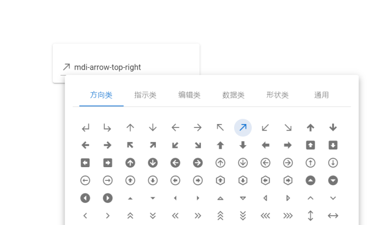

# Vuetify Icon Picker

一个 Vuetify 中的 [material design icons](https://materialdesignicons.com/) 选择器。

## Preface

当使用 [vuetify](https://vuetifyjs.com/) 框架实现诸如菜单管理业务时，面对 6000+ 个 Material Design Icons，你是否苦恼于没有一个合适的 icon 选择器?

**Vuetify Icon Picker** 便是如此的一个组件！

## 起步

### 安装

```shell
npm i vuetify-icon-picker
```

### 使用

在 2.x 版本的普通 vuetify project 中，在通过 html 头部 cdn 链接方式或者 `npm i @mdi/font` 方式引入了 `mdi` 之后，你可以这样使用这个组件：

```vue
<template>
  <icon-picker v-model="selected" />
</template>

<script>
import IconPicker from "./components/IconPicker.vue";

export default {
  components: {
    IconPicker
  },
  data: () => ({
    selected: ""
  })
};
</script>
```

[本 REPO](https://github.com/taoqingqiu/vuetify-icon-picker) 的 `src/App.vue` 中便是一个详细的例子。

## 吹嘘

本着造福大众的精神，参照某 eecg 的分类，陶某严格从 6000+ 个 icons 中，按照 `方向`、`指示`、`编辑`、`数据`、`形状`、`通用` 几个类别中分别挑选出 83、37、108、16、66、96 个 icons。其效果如下：



更具体的示例见 [此](https://taoqingqiu.github.io/vuetify-icon-picker/)

## 组件 API

### 属性

| Name          | Type     | Default   | Description                         |
| ------------- | -------- | --------- | ----------------------------------- |
| contentHeight | `number` | 300       | 放置图标的容器元素的高度            |
| value         | `string` | undefined | 选中的图标，形如 `mdi-home-outline` |

### 事件

| Name  | Description                                          |
| ----- | ---------------------------------------------------- |
| input | 顾名思义，与 `value` 属性一起可适配 `v-model` 语法糖 |
